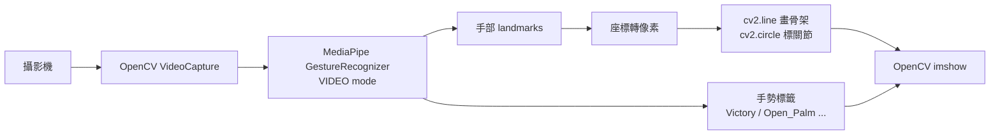

# MediaPipe 手勢辨識 — 手動繪製骨架練習

> 用 MediaPipe Tasks API 做手勢辨識，並用 OpenCV 手動畫骨架（不依賴 `drawing_utils`）。

**Author**: [@Lee-unhn](https://github.com/Lee-unhn) · a2264563@gmail.com  
**Status**: 學習專案 / Learning Project

## 專案簡介

本專案包含一個 Python 腳本 (`work1.py`) 和一個 MediaPipe 手勢辨識模型 (`gesture_recognizer.task`)。重點是練習如何用 MediaPipe `tasks` API 做即時手勢辨識，並**完全透過 OpenCV 手動繪製手部骨架與關節點**，不依賴 `mediapipe.solutions.drawing_utils`（在不同版本間可能有差異）。

核心練習點：

- 使用 `mediapipe.tasks.vision.GestureRecognizer` 以 `VIDEO` 串流模式運行
- 自行定義 `HAND_CONNECTIONS`（手部關節連線）
- 把模型輸出的 landmarks 轉換為畫面實際像素座標
- 用 `cv2.line` 畫骨架、`cv2.circle` 標關節點
- 即時顯示手勢名稱（如 "Victory"、"Open_Palm"）

## 架構



## 技術棧

- Python 3.8+
- MediaPipe (`mediapipe.tasks.vision.GestureRecognizer`)
- OpenCV

## 主要檔案

- `work1.py` — 主腳本
- `gesture_recognizer.task` — MediaPipe 預訓練手勢模型

## 使用 / Usage

### 1. 前置條件
*   Python 3.8 或更高版本。
*   已連接的電腦攝影機。

### 2. 確認檔案
*   確保 `work1.py` 和 `gesture_recognizer.task` 兩個檔案位於同一個資料夾中。

### 3. 安裝依賴
本專案所需的主要套件為：
*   `mediapipe`
*   `opencv-python`

您可以透過 `pip` 進行安裝：
```bash
pip install mediapipe opencv-python
```

### 4. 執行腳本
在 `AI-media` 資料夾下，執行以下指令：
```bash
python work1.py
```
程式會開啟一個顯示攝影機畫面的視窗，並在您的手部出現時繪製出手部骨架。在命令列視窗按下 `q` 鍵可關閉程式。

## 備註

本專案為 AI 視覺應用學習練習，模型路徑與部分設定可能為硬編碼。如要重現請依 README 調整。
